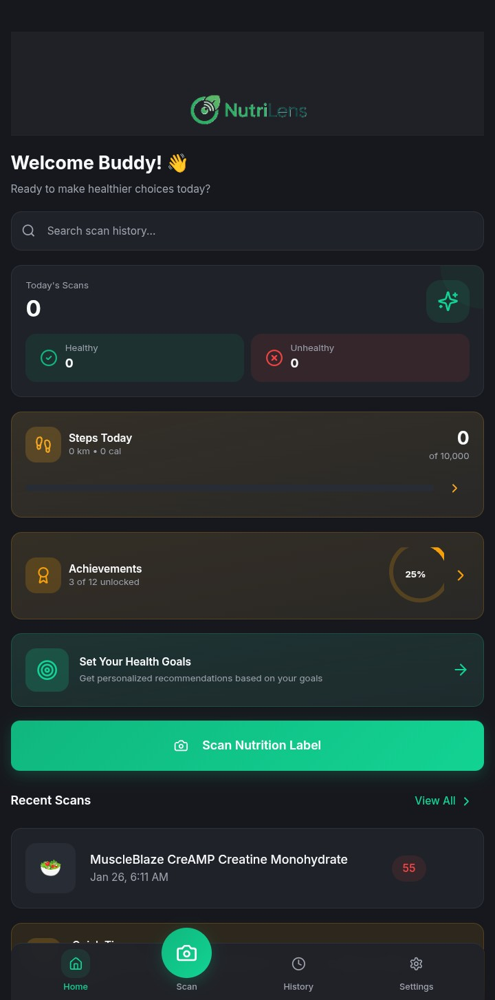
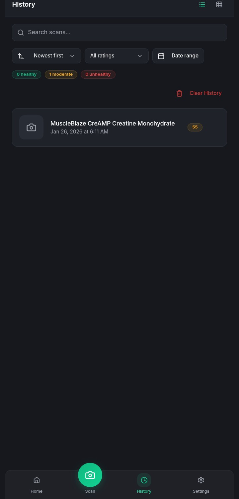
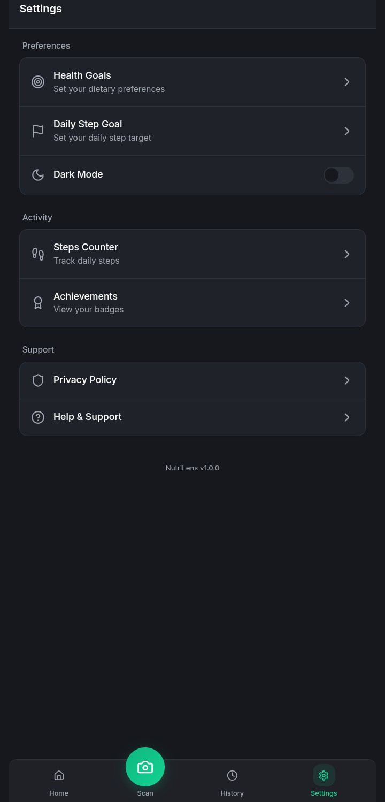
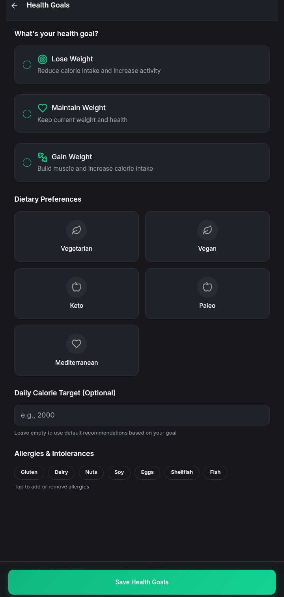
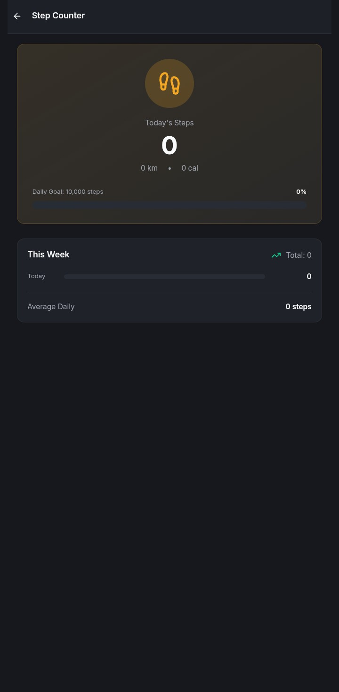
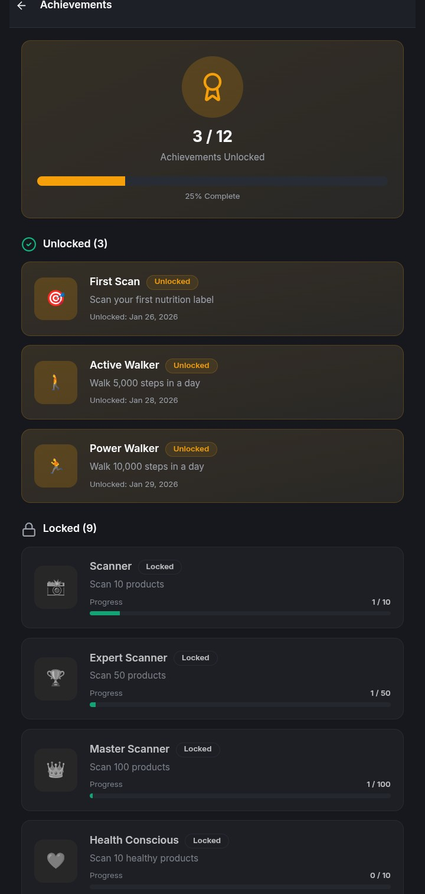

## NutriLens (React + Capacitor)

NutriLens is a nutrition and wellness companion that lets you:

- Scan food labels to get instant nutrition analysis
- Track your daily steps with a native Android motion‑sensor step counter
- Set health and activity goals and monitor progress over time
- Use a clean mobile‑first UI as a PWA or native mobile app

This repo contains the React/TypeScript frontend (Vite) plus the Android Capacitor shell and Supabase integration.

---

## Table of contents

- **Overview**
- **Tech stack**
- **Project structure**
- **Getting started**
  - Prerequisites
  - Environment variables
  - Install & run (web)
  - Production build (web)
- **📱 Download & Try the App**
  - Direct APK Download
  - Installation Instructions
  - Features Available in APK
- **Android / mobile build**
- **Step counter & widgets**
- **Scripts**
- **Screenshots**
- **Troubleshooting**

---

## Overview

NutriLens focuses on making healthier choices easy:

- **Label scanning** – use the camera to scan product labels and get AI‑driven nutrition insights.
- **History & trends** – see previous scans and long‑term nutrition trends.
- **Health goals** – configure calorie and macro goals, plus activity goals.
- **Step tracking** – continuous daily step tracking using the device motion sensors (on Android), with a compact home‑screen widget.

---

## Tech stack

- **Frontend**
  - React 18 + TypeScript
  - Vite
  - Tailwind CSS + shadcn/ui component system
  - React Router

- **Mobile / native**
  - Capacitor 8
  - Android native plugins for:
    - Camera & gallery access
    - Step counter + widgets (`StepCounterPlugin`, `StepsCircleWidgetProvider`)

- **Backend / services**
  - Supabase (Postgres + Edge Functions)
  - AI nutrition analysis (Supabase Edge functions in `supabase/functions`)

---
## Screenshots
  ### Home Page
  

  ### Scan History
  

  ### Settings
  

  ### Health Goals
  

  ### Step Counter
  

  ### Achievments
  

---

## Project structure (high level)

```text
android/                # Native Android project (Capacitor shell, widgets, plugins)
public/                 # Static assets & PWA manifest
src/
  App.tsx               # App root, routes
  main.tsx              # Vite entry point
  assets/               # Logos & images
  components/           # Reusable UI + layout components
  hooks/                # Custom hooks (camera, steps, PWA install, etc.)
  pages/                # Route-level screens (Home, Scan, Steps, Trends, ...)
  plugins/              # Capacitor plugin TypeScript shims
  services/             # AI + OCR + image processing services
  integrations/
    supabase/           # Supabase client + types
supabase/               # Supabase config & edge functions
```

---

## Getting started

### 1. Prerequisites

- Node.js 18+ (LTS recommended)
- npm (or pnpm/bun if you prefer)
- Git
- For Android builds:
  - Android Studio + SDK
  - Java 17 (for AGP 8+)

### 2. Environment variables

Create a `.env` file in the project root (it will be ignored by Git) and add your secrets, for example:

```bash
VITE_SUPABASE_URL=your-supabase-url
VITE_SUPABASE_ANON_KEY=your-supabase-anon-key
VITE_OPENAI_API_KEY=your-openai-key   # only if you use hosted AI
```

Check the Supabase and AI integration code under `src/services` and `supabase/` for the exact variables you need in your setup.

### 3. Install dependencies

```bash
npm install
```

### 4. Run the web app (dev)

```bash
npm run dev
```

Then open the printed `http://localhost:5173` URL in your browser.

### 5. Production build (web)

```bash
npm run build
npm run preview   # optional: serve the built app locally
```

---

## 📱 Download & Try the App

Want to experience NutriLens without building it yourself? You can download the pre-built Android APK:

### Direct APK Download
- **Download**: [NutriLens.apk](App/NutriLens.apk)
- **Size**: ~15MB
- **Requirements**: Android 8.0+ (API 26+)

### Installation Instructions
1. Download the APK file from the link above
2. On your Android device, enable "Install from unknown sources" in Settings
3. Tap the downloaded APK to install
4. Grant permissions when prompted (Camera, Storage, Activity Recognition)
5. Launch the app and start scanning!

### Features Available in APK
- ✅ Camera-based food label scanning
- ✅ AI-powered nutrition analysis
- ✅ Daily step tracking with home screen widget
- ✅ Health goals and progress tracking
- ✅ Scan history and trends
- ✅ Offline functionality (except AI analysis)

---

## Android / mobile build

This project is already configured for Capacitor + Android.

1. Build the web assets:

   ```bash
   npm run build
   ```

2. Sync Capacitor:

   ```bash
   npm run cap:build   # or: npx cap sync
   ```

3. Open the Android project:

   ```bash
   npm run cap:android   # opens in Android Studio
   ```

4. From Android Studio:
   - Select a device/emulator
   - Press **Run** to install and launch the app

The **Steps** screen are available only on Android builds (not in the plain web app).

---

## Step counter 

### How step tracking works

- On Android, the app uses native motion sensors via a Capacitor plugin (`StepCounterPlugin`).
- The React hook `src/hooks/use-steps.ts`:
  - Starts tracking automatically on native devices
  - Persists daily and weekly step counts in local storage
  - Exposes `todaySteps`, `weeklySteps`, and goal helpers to the UI

---

## Available npm scripts

From `package.json`:

- `npm run dev` – Start Vite dev server
- `npm run build` – Build production assets
- `npm run build:dev` – Build in development mode
- `npm run preview` – Preview the built app locally
- `npm run lint` – Run ESLint on the project
- `npm run cap:sync` – Sync Capacitor platforms
- `npm run cap:android` – Open Android Studio project
- `npm run cap:build` – Build + sync for Capacitor
- `npm run generate:icons` – Generate app icons from source

---


## Troubleshooting

- **Step counter not updating on Android**
  - Make sure activity recognition / motion sensor permissions are granted.
  - Confirm you are running a native Android build (web cannot access pedometer sensors directly).

- **Supabase / AI calls failing**
  - Double‑check `.env` values and that they are prefixed with `VITE_` for Vite.

- **Capacitor sync issues**
  - Run `npx cap doctor` and `npx cap sync android` again.
  - If Android build fails, open it in Android Studio and let Gradle sync/upgrade.

---

## License

This project is intended for personal / portfolio use. If you plan to reuse or redistribute it, please add an explicit license file that matches your needs (MIT, Apache‑2.0, etc.).

#
